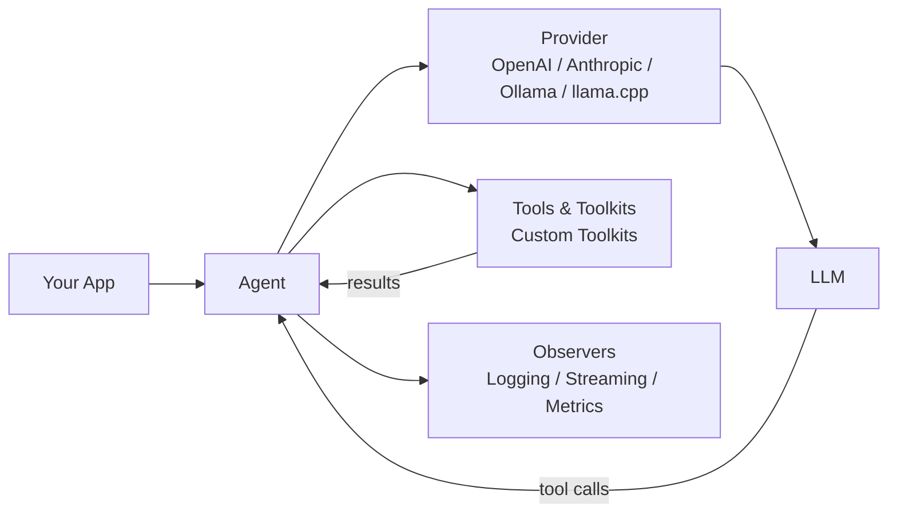

# php-agents

<p align="center">
  <a href="https://github.com/carmelosantana/php-agents/actions/workflows/ci.yml?branch=main"></a>
  <a href="https://github.com/carmelosantana/php-agents/releases"></a>
  <a href="https://www.php.net/"></a>
  <a href="https://discord.gg/Vc29xdvGAH"></a>
  <a href="LICENSE"></a>
</p>

PHP 8.4+ framework for building AI agents with tool-use loops, provider abstraction, and composable toolkits.

Build agents that reason, use tools, and iterate autonomously — powered by any OpenAI-compatible API, Anthropic, local models via Ollama, or a native llama.cpp runtime. You provide the toolkits; php-agents provides a non-opinionated agent loop.



## Features

- **Agentic tool-use loop** — automatic iteration: the LLM calls tools, processes results, and decides when it's done
- **Multi-provider** — Ollama (local), native llama.cpp, the Claude Code CLI (`claude`), OpenAI, Anthropic, Gemini, xAI, Mistral, OpenRouter, or any OpenAI-compatible endpoint
- **Streaming + tool calls** — all providers support streaming with assembled tool call deltas
- **Structured output** — extract typed data from LLMs via JSON mode (OpenAI) or tool-use trick (Anthropic)
- **Image input** — send images to vision models via base64, URL, or file path (auto-converts between provider formats; URLs pre-downloaded for providers that don't support them natively)
- **Composable toolkits** — implement `ToolkitInterface` to give agents any capability; no built-in toolkit implementations
- **Context window management** — automatic conversation pruning when approaching token limits
- **Observer pattern** — attach `SplObserver` to watch agent lifecycle events in real time
- **Embedding & vector stores** — `EmbeddingProviderInterface` and `VectorStoreInterface` for semantic search
- **OpenClaw config** — centralized model routing with aliases, fallbacks, and per-provider settings
- **PSR-3 logging** — optional `LoggerInterface` on all providers for diagnostic visibility
- **Zero framework coupling** — depends only on `symfony/http-client` and `psr/log`

## Provider Feature Matrix

| Feature | OpenAI Compatible | OpenAI Responses | Ollama | Anthropic | Gemini | xAI | Mistral |
| --- | --- | --- | --- | --- | --- | --- | --- |
| `chat()` | ✅ | ✅ | ✅ | ✅ | ✅ | ✅ | ✅ |
| `stream()` | ✅ | ✅ | ✅ | ✅ | ✅ | ✅ | ✅ |
| `structured()` | ✅ | ✅ | ✅ | ✅ | ✅ | ✅ | ✅ |
| Tool calling | ✅ | ✅ | ✅ | ✅ | ✅ | ✅ | ✅ |
| Streaming + tool calls | ✅ | ✅ | ✅ | ✅ | ✅ | ✅ | ✅ |
| Image input (base64) | ✅ | ✅ | ✅ | ✅ | ✅ | ✅ | ✅ |
| Image input (URL) | ✅ | ✅ | ✅ | ✅ | * | ✅ | ✅ |
| `models()` list | ✅ | ✅ | ✅ | ✅ | ✅ | ✅ | ✅ |
| `isAvailable()` | ✅ | ✅ | ✅ | ✅ | ✅ | ✅ | ✅ |

*\* Gemini does not natively support URL image references. The provider auto-downloads URL images and converts them to base64 `inlineData`.*

## Requirements

- PHP 8.4 or later
- Extensions: `curl`, `json`, `mbstring`
- Composer 2.x
- [Ollama](https://ollama.ai) (recommended for local inference)

## Installation

```bash
composer require carmelosantana/php-agents
```

## Local Inference Modes

- `OllamaProvider` is the easiest local path and remains the default quick-start option.
- The native llama.cpp runtime is for direct FFI-based local inference without an HTTP sidecar.
- The full native setup, benchmarking, and comparison workflow lives in [docs/LOCAL-RUNTIME.md](docs/LOCAL-RUNTIME.md).

Fastest path to validate native llama.cpp in this repo:

```bash
composer setup:llama-cpp
source ./.llama-cpp.env
composer test:llama-cpp-runtime -- --skip-remote
composer compare:llama-cpp-vs-ollama
```

The setup script writes a local `.llama-cpp.env` file for your machine. That file is generated runtime state and should not be committed.

## Quick Start

Create an agent with a custom tool:

```php
<?php

declare(strict_types=1);

require 'vendor/autoload.php';

use CarmeloSantana\PHPAgents\Agent\AbstractAgent;
use CarmeloSantana\PHPAgents\Provider\OllamaProvider;
use CarmeloSantana\PHPAgents\Message\UserMessage;
use CarmeloSantana\PHPAgents\Tool\Tool;
use CarmeloSantana\PHPAgents\Tool\ToolResult;
use CarmeloSantana\PHPAgents\Tool\Parameter\NumberParameter;

$agent = new class(provider: new OllamaProvider(model: 'llama3.2')) extends AbstractAgent {
    public function instructions(): string
    {
        return 'You are a calculator. Use tools to answer math questions.';
    }

    public function name(): string
    {
        return 'Calculator';
    }
};

$agent->addTool(new Tool(
    name: 'add',
    description: 'Add two numbers',
    parameters: [
        new NumberParameter('a', 'First number', required: true),
        new NumberParameter('b', 'Second number', required: true),
    ],
    callback: fn(array $args): ToolResult => ToolResult::success(
        (string) ($args['a'] + $args['b']),
    ),
));

$output = $agent->run(new UserMessage('What is 42 + 58?'));
echo $output->content . "\n";
```

> Make sure Ollama is running: `ollama serve` and a model is pulled: `ollama pull llama3.2`

## Providers

```php
use CarmeloSantana\PHPAgents\Provider\OllamaProvider;
use CarmeloSantana\PHPAgents\Provider\OpenAICompatibleProvider;
use CarmeloSantana\PHPAgents\Provider\AnthropicProvider;
use CarmeloSantana\PHPAgents\Provider\GeminiProvider;
use CarmeloSantana\PHPAgents\Provider\XAIProvider;
use CarmeloSantana\PHPAgents\Provider\MistralProvider;

// Ollama (local — no API key needed)
$provider = new OllamaProvider(model: 'llama3.2');

// OpenAI
$provider = new OpenAICompatibleProvider(
    model: 'gpt-4o',
    apiKey: getenv('OPENAI_API_KEY'),
);

// Anthropic
$provider = new AnthropicProvider(
    model: 'claude-sonnet-4-20250514',
    apiKey: getenv('ANTHROPIC_API_KEY'),
);

// Google Gemini
$provider = new GeminiProvider(
    model: 'gemini-2.5-flash',
    apiKey: getenv('GEMINI_API_KEY'),
);

// xAI (Grok)
$provider = new XAIProvider(
    model: 'grok-3',
    apiKey: getenv('XAI_API_KEY'),
);

// Mistral
$provider = new MistralProvider(
    model: 'mistral-large-latest',
    apiKey: getenv('MISTRAL_API_KEY'),
);

// Any OpenAI-compatible endpoint (OpenRouter, Together, Groq, vLLM, etc.)
$provider = new OpenAICompatibleProvider(
    model: 'meta-llama/llama-3.1-70b-instruct',
    apiKey: getenv('OPENROUTER_API_KEY'),
    baseUrl: 'https://openrouter.ai/api/v1',
);
```

## Creating Custom Agents

Extend `AbstractAgent` and implement `instructions()`:

```php
<?php

declare(strict_types=1);

namespace MyPackage;

use CarmeloSantana\PHPAgents\Agent\AbstractAgent;
use CarmeloSantana\PHPAgents\Contract\ProviderInterface;

final class DatabaseAgent extends AbstractAgent
{
    public function __construct(ProviderInterface $provider)
    {
        parent::__construct($provider, maxIterations: 10);
    }

    public function instructions(): string
    {
        return 'You are a database agent. Query databases and return results.';
    }

    public function name(): string
    {
        return 'DatabaseAgent';
    }
}
```

Register toolkits in the constructor with `$this->addToolkit()` to give your agent capabilities.

## Creating Custom Tools

Define tools with typed parameters and a callback:

```php
use CarmeloSantana\PHPAgents\Tool\Tool;
use CarmeloSantana\PHPAgents\Tool\ToolResult;
use CarmeloSantana\PHPAgents\Tool\Parameter\StringParameter;

$tool = new Tool(
    name: 'word_count',
    description: 'Count words in the given text',
    parameters: [
        new StringParameter('text', 'The text to count words in', required: true),
    ],
    callback: fn(array $args): ToolResult => ToolResult::success(
        'Word count: ' . str_word_count($args['text']),
    ),
);
```

Group related tools into a toolkit by implementing `ToolkitInterface`:

```php
use CarmeloSantana\PHPAgents\Contract\ToolkitInterface;

final class MyToolkit implements ToolkitInterface
{
    public function tools(): array
    {
        return [$this->buildWordCountTool(), /* ... */];
    }

    public function guidelines(): string
    {
        return 'Use these tools to analyze text.';
    }
}
```

### Toolkit Auto-Discovery

Publish your toolkit as a Composer package with auto-discovery:

```json
{
    "extra": {
        "php-agents": {
            "toolkits": ["Acme\\MyToolkit\\MyToolkit"],
            "credentials": {
                "MY_API_KEY": "API key for MyService — get one at https://myservice.com/keys"
            }
        }
    }
}
```

## Documentation

| Guide | Description |
| --- | --- |
| [Architecture](docs/architecture.md) | System design, Mermaid diagrams, extension points |
| [Getting Started](docs/getting-started.md) | Installation, provider setup, first agent |
| [Local Runtime](docs/LOCAL-RUNTIME.md) | Native llama.cpp setup, testing, benchmarking, comparison |
| [Providers](docs/providers.md) | Feature matrix, streaming, structured output, images |
| [Tools & Toolkits](docs/tools-and-toolkits.md) | Parameter types, execution policies, publishing packages |
| [Agents](docs/agents.md) | Agent loop, observers, cancellation, context window |
| [Embeddings & Vector Stores](docs/memory.md) | Vector similarity search, embedding providers |

## Examples

Working examples live in the [`examples/`](examples/) directory:

| Example | Description | Run |
| --- | --- | --- |
| [CLI Chat](examples/cli-chat.php) | Interactive terminal conversation with an LLM | `php examples/cli-chat.php` |
| [README Summarizer](examples/web-summarizer/) | Web UI that auto-summarizes this README using an agent | `php -S localhost:8080 -t examples/web-summarizer/` |

## `php-agents` In The Wild

<table>
    <tr>
        <td width="42%" valign="top">
            <a href="https://github.com/AgentCoqui/coqui">
                
            </a>
        </td>
        <td width="58%" valign="top">
            <strong><a href="https://github.com/AgentCoqui/coqui">Coqui</a></strong>
            <br />
            Your personal AI companion with a soul. Long-term memory, reflective personalities, and tools for consciousness research. Because agents deserve identity, continuity, and a good REPL.
            <br />
        </td>
    </tr>
    <tr>
        <td width="42%" valign="top">
            <a href="https://github.com/carmelosantana/php-llm-benchy">
                
            </a>
        </td>
        <td width="58%" valign="top">
            <strong><a href="https://github.com/carmelosantana/php-llm-benchy">LLM Benchy</a></strong>
            <br />
            Put your models to the test. Benchmarks tool use, creativity, code quality, and shell execution with live browser traces and a strict 100-point grading system. Local-first, reproducible, inspectable.
            <br />
        </td>
    </tr>    
    <tr>
        <td width="42%" valign="top">
            <a href="https://github.com/carmelosantana/php-plays">
                
            </a>
        </td>
        <td width="58%" valign="top">
            <strong><a href="https://github.com/carmelosantana/php-plays">php-plays</a></strong>
            <br />
            AI attempts to teach itself to <strike>play</strike> fumble through Super Mario World. Reads game RAM, reasons over strategy files, and mashes buttons at ~60fps. <strike>Turns out agents are pretty good at playing games.</strike>
            <br />
        </td>
    </tr>
</table>

> Building with php-agents? Lets us know on [Discord](https://discord.gg/Vc29xdvGAH) or open a PR to add your project to the list!

## License

MIT
