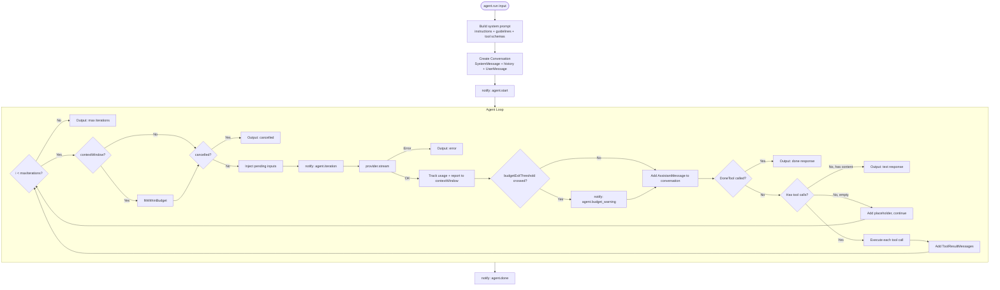

# Agents

Agents are the core abstraction — they combine a provider, tools, and policies into an iterative loop that can reason and act.

## AbstractAgent

All agents extend `AbstractAgent`, which provides the complete agent loop. Your subclass only needs to define:

1. `name()` — the agent's identity
2. `instructions()` — the system prompt
3. Tools (via toolkits or `addTool()`)

```php
<?php

declare(strict_types=1);

namespace Acme;

use CarmeloSantana\PHPAgents\Agent\AbstractAgent;

final class ResearchAgent extends AbstractAgent
{
    public function name(): string
    {
        return 'Research Assistant';
    }

    public function instructions(): string
    {
        return <<<INSTRUCTIONS
        You are a research assistant. Your job is to:
        1. Search the web for information on the user's topic
        2. Read relevant pages
        3. Synthesize findings into a clear summary
        Always cite your sources.
        INSTRUCTIONS;
    }
}
```

## Constructor Parameters

```php
$agent = new ResearchAgent(
    provider: $provider,                    // Required: ProviderInterface
    maxIterations: 25,                      // Max tool-use loops (default: 25)
    executionPolicy: new MyPolicy(),        // Optional: tool gating
    cancellationToken: $token,              // Optional: cooperative cancellation
    pendingInputProvider: $inputProvider,   // Optional: external input injection
    contextWindow: new ContextWindow(...),  // Optional: token budget tracking
    safetyMarginPercent: 20,                // Optional: pruning safety margin
    budgetExitThreshold: 0.85,              // Optional: graceful wrap-up threshold
    budgetExitWrapUpIterations: 2,          // Optional: extra iterations after warning
);
```

| Parameter | Type | Default | Purpose |
|-----------|------|---------|---------|
| `provider` | `ProviderInterface` | — | LLM to use for reasoning |
| `maxIterations` | `int` | `25` | Safety limit on tool-use loops |
| `executionPolicy` | `?ToolExecutionPolicyInterface` | `null` | Pre-execution tool gating |
| `cancellationToken` | `?CancellationTokenInterface` | `null` | Cooperative cancellation |
| `pendingInputProvider` | `?PendingInputProviderInterface` | `null` | Inject messages mid-loop |
| `contextWindow` | `?ContextWindowInterface` | `null` | Token budget tracking + auto-pruning |
| `safetyMarginPercent` | `int` | `20` | Headroom applied before pruning to absorb token-estimation drift |
| `budgetExitThreshold` | `float` | `0.0` | Optional ratio `0.0`-`1.0`; emits `agent.budget_warning` once when the current iteration crosses the threshold |
| `budgetExitWrapUpIterations` | `int` | `2` | Extra iterations allowed after a budget warning before the loop returns `BudgetExhausted` |

## The Run Loop in Detail



## Adding Tools and Toolkits

```php
final class MyAgent extends AbstractAgent
{
    public function instructions(): string
    {
        return 'You are a helpful assistant.';
    }

    public function tools(): array
    {
        return [$myTool];
    }
}

// Add a toolkit (registers all its tools + injects guidelines)
$agent->addToolkit(new MyCustomToolkit());
```

Tools returned by `tools()` are merged with toolkit tools. Guidelines from all toolkits are concatenated and appended to the system prompt.

php-agents does not ship built-in toolkit implementations. Your application provides toolkits by implementing `ToolkitInterface`. See [Tools & Toolkits](tools-and-toolkits.md) for details on creating and publishing toolkits.

## Observer Pattern

Agents implement `SplSubject`. Attach observers for logging, streaming UI, metrics, or any side-effect:

```php
use SplObserver;
use SplSubject;

final class MetricsObserver implements SplObserver
{
    private int $toolCalls = 0;
    private int $iterations = 0;

    public function update(SplSubject $subject): void
    {
        if (!method_exists($subject, 'lastEvent')) {
            return;
        }

        match ($subject->lastEvent()) {
            'agent.iteration' => $this->iterations++,
            'agent.tool_call' => $this->toolCalls++,
            default => null,
        };
    }

    public function summary(): string
    {
        return sprintf('%d iterations, %d tool calls', $this->iterations, $this->toolCalls);
    }
}

$metrics = new MetricsObserver();
$agent->attach($metrics);
$output = $agent->run(new UserMessage('...'));
echo $metrics->summary();
```

### Events Reference

| Event | Data Type | Description |
|-------|-----------|-------------|
| `agent.start` | `MessageInterface` | The input message before first iteration |
| `agent.iteration` | `int` | Iteration number (1-based) |
| `agent.tool_call` | `ToolCall` | Before a tool is executed |
| `agent.tool_result` | `ToolResult` | After successful tool execution |
| `agent.tool_error` | `string` | When a tool throws an exception |
| `agent.done` | `array` | Agent completed (contains response data) |
| `agent.budget_warning` | `array{usagePercent: float, threshold: float, wrapUpIterations: int}` | Budget threshold was crossed for the current iteration |
| `agent.error` | `string` | Unrecoverable error in agent loop |

## Cooperative Cancellation

Long-running agents can be cancelled via `CancellationTokenInterface`:

```php
use CarmeloSantana\PHPAgents\Contract\CancellationTokenInterface;

final class TimeoutToken implements CancellationTokenInterface
{
    private readonly float $deadline;

    public function __construct(int $timeoutSeconds)
    {
        $this->deadline = microtime(true) + $timeoutSeconds;
    }

    public function isCancelled(): bool
    {
        return microtime(true) >= $this->deadline;
    }
}

$agent = new MyAgent(
    provider: $provider,
    cancellationToken: new TimeoutToken(30),
);

// Agent will stop after 30 seconds, even mid-loop
```

The cancellation check happens at the top of each iteration, so the current iteration always completes before stopping.

## Pending Input Injection

Inject messages into the agent loop from external sources (e.g., user typing while the agent is working):

```php
use CarmeloSantana\PHPAgents\Contract\PendingInputProviderInterface;
use CarmeloSantana\PHPAgents\Contract\MessageInterface;

final class QueuedInputProvider implements PendingInputProviderInterface
{
    private array $queue = [];

    public function addInput(MessageInterface $message): void
    {
        $this->queue[] = $message;
    }

    public function consumePendingInputs(): array
    {
        $inputs = $this->queue;
        $this->queue = [];
        return $inputs;
    }
}

$inputProvider = new QueuedInputProvider();
$agent = new MyAgent(
    provider: $provider,
    pendingInputProvider: $inputProvider,
);

// From another thread/fiber:
$inputProvider->addInput(new UserMessage('Actually, also check the tests/ directory'));
```

## Context Window Integration

Prevent conversations from exceeding model token limits:

```php
use CarmeloSantana\PHPAgents\Context\ContextWindow;
$contextWindow = new ContextWindow(
    maxTok: 128_000,   // Model's context limit
    reservedTok: 4_000 // Space reserved for the response
);

$agent = new MyAgent(
    provider: $provider,
    contextWindow: $contextWindow,
);
```

When the conversation approaches the token budget, the agent loop automatically:

1. Trims long tool results
2. Drops oldest conversation turns
3. Re-trims tool results more aggressively if one turn still exceeds budget
4. Repairs orphaned tool-result/assistant-message pairs
5. Merges consecutive same-role messages

If `budgetExitThreshold` is configured and a `ContextWindow` is present, the agent also emits `agent.budget_warning` once when the latest provider-reported usage for the current iteration crosses the configured threshold. The loop then allows `budgetExitWrapUpIterations` additional iterations before returning `AgentFinishReason::BudgetExhausted`.

## The Output Value Object

`AbstractAgent::run()` returns an `Output` with the agent's response and metadata:

```php
$output = $agent->run(new UserMessage('...'));

$output->content;      // string — the final text response
$output->toolResults;  // ToolResult[] — tool results accumulated across the run
$output->usage;        // Usage — total token usage across all iterations
$output->model;        // string — model name reported by the provider
$output->iterations;   // int — iterations consumed by the loop
$output->conversation; // Conversation|null — full in-memory conversation
$output->finishReason; // AgentFinishReason — why the agent stopped
```

### Finish Reasons

| Reason | Meaning |
|--------|---------|
| `AgentFinishReason::Stop` | Agent returned a text response without using `done()` |
| `AgentFinishReason::MaxIterations` | Agent loop exhausted its configured `maxIterations` budget |
| `AgentFinishReason::Error` | An error occurred in the agent loop |
| `AgentFinishReason::Done` | Agent completed via the built-in `done()` tool |
| `AgentFinishReason::BudgetExhausted` | Budget wrap-up iterations were exhausted after a budget warning |

Provider responses use `ProviderFinishReason` instead. That enum represents normalized model/API stop reasons such as `Stop`, `ToolUse`, `MaxTokens`, and provider-level `Error` states.
