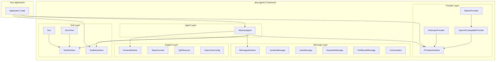
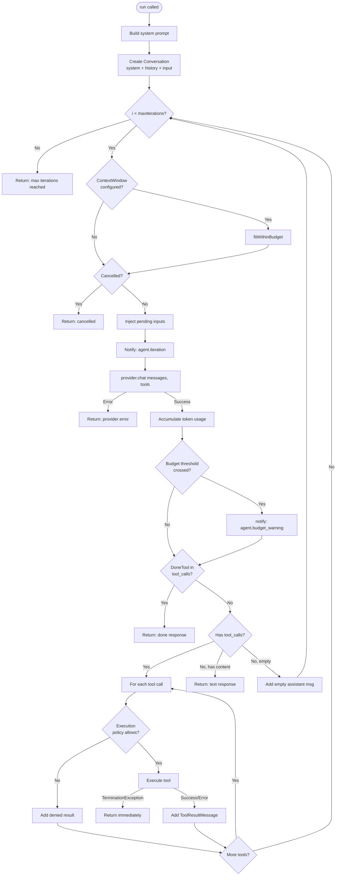
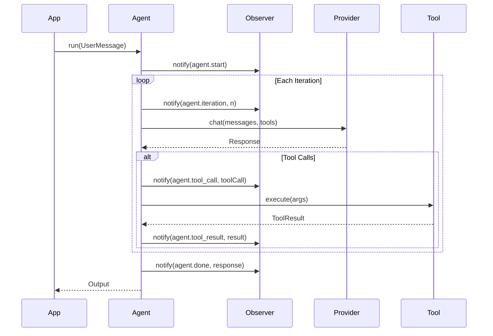
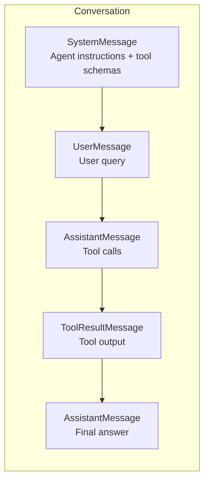
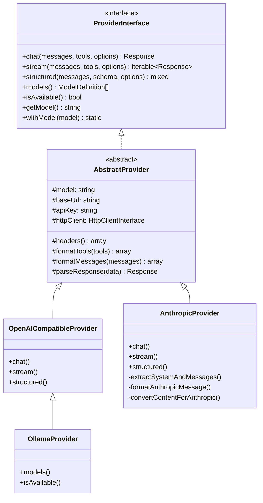
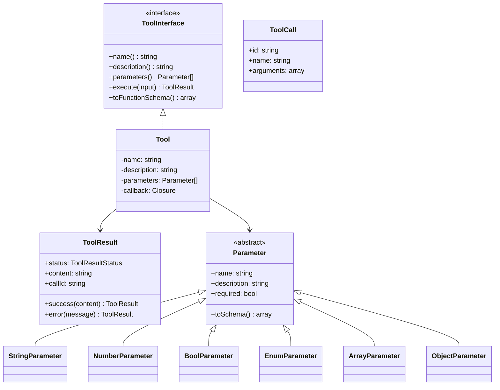
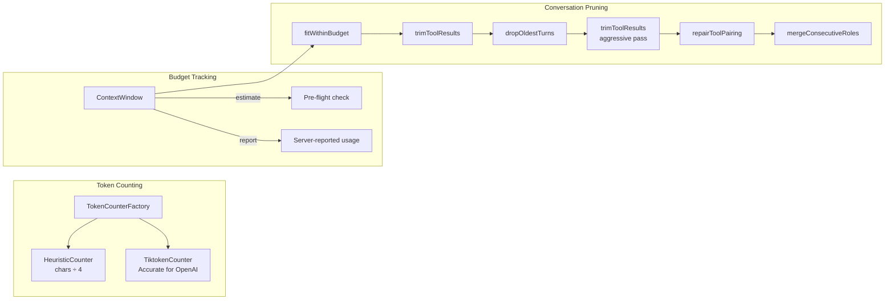
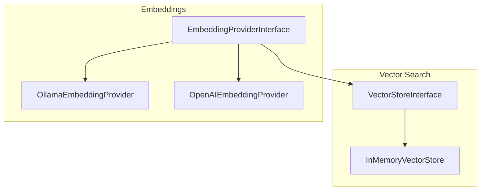

# Architecture

php-agents is a layered, composable PHP 8.4 framework for building AI agents with tool-use loops. This document explains the architecture, data flow, and extension points.

## High-Level Overview



## The Agent Loop

The core of php-agents is the iterative agent loop in `AbstractAgent::run()`. This is where the "agentic" behavior happens — the LLM decides what tools to call, processes results, and continues until it decides it's done.



## Key Design Principles

### Composition Over Inheritance

Agents are composed from providers, toolkits, and policies rather than inheriting complex behavior:

```php
$agent = new class(
    provider: new OllamaProvider(model: 'llama3.2'),
    maxIterations: 10,
    executionPolicy: new MyPolicy(),
) extends AbstractAgent {
    public function name(): string { return 'My Agent'; }
    public function instructions(): string { return 'You help users.'; }
};
```

### Interface-Driven Extensibility

Every major component has an interface contract. You can replace any layer:

| Interface | Purpose | Default Implementations |
|-----------|---------|------------------------|
| `ProviderInterface` | LLM communication | OpenAI, Anthropic, Ollama |
| `ToolInterface` | Tool definitions | `Tool` (closure-based) |
| `ToolkitInterface` | Tool groups + guidelines | (none — implement your own) |
| `ToolExecutionPolicyInterface` | Pre-execution gating | (none — implement your own) |
| `CancellationTokenInterface` | Cooperative cancellation | `NullCancellationToken` |
| `PendingInputProviderInterface` | External input injection | `NullPendingInputProvider` |
| `ContextWindowInterface` | Token budget tracking | `ContextWindow` |
| `VectorStoreInterface` | Similarity search | `InMemoryVectorStore` |
| `EmbeddingProviderInterface` | Text → vector | Ollama, OpenAI |
| `TokenCounterInterface` | Token counting | `HeuristicCounter`, `TiktokenCounter` |
| `ConfigInterface` | Configuration source | `OpenClawConfig` |

### The Observer Pattern

Agents implement `SplSubject` and emit events throughout the loop. Attach observers for logging, UI updates, streaming, or any side-effect:



**Events emitted:**

| Event | Data | When |
|-------|------|------|
| `agent.start` | `MessageInterface` | Before first iteration |
| `agent.iteration` | `int` (iteration number) | Top of each loop |
| `agent.tool_call` | `ToolCall` | Before executing a tool |
| `agent.tool_result` | `ToolResult` | After tool execution |
| `agent.tool_error` | `string` (error message) | When a tool throws |
| `agent.done` | `array` (response) | Agent finished |
| `agent.error` | `string` (error message) | Unrecoverable error |

## Message Flow

Messages flow through the system in a structured conversation:



Each message type maps to a specific role:

| Class | Role | Content | Special Fields |
|-------|------|---------|----------------|
| `SystemMessage` | `system` | `string` | — |
| `UserMessage` | `user` | `string\|array` (multimodal) | — |
| `AssistantMessage` | `assistant` | `string` | `toolCalls: ToolCall[]` |
| `ToolResultMessage` | `tool` | `string` | `callId: string` |

## Provider Architecture

Providers abstract LLM API differences behind a unified interface:



## Tool System

Tools are the actions an agent can take. They're defined with typed parameters and return structured results:



## Context Window Management

The context window system prevents conversations from exceeding model limits:



When `budgetExitThreshold` is enabled, `AbstractAgent` treats it as a generic loop policy: once the latest provider-reported usage for an iteration crosses the configured threshold, it emits `agent.budget_warning` and allows a small wrap-up window before returning `AgentFinishReason::BudgetExhausted`. Product-specific reactions, such as Coqui's workflow-aware wrap-up prompt, remain outside php-agents and are implemented via observers plus `PendingInputProviderInterface`.

## Embedding & Vector Store Architecture



## How Coqui Extends php-agents

[Coqui](https://github.com/coquibot/coqui) is a full product built on php-agents. It demonstrates the framework's extensibility without duplicating any core logic:

```mermaid
graph TB
    subgraph "Coqui Product Layer"
        OA[OrchestratorAgent]
        CHA[ChildAgent]
        REPL[RunCommand / REPL]
        API[ReactPHP API Server]
        SS[SessionStorage / SQLite]
        TD[ToolkitDiscovery]
        CR[CredentialResolver]
        BT[BackgroundTaskManager]
        SP[SpawnAgentTool]
        PE[PhpExecuteTool]
        OBS[TerminalObserver / SseObserver]
    end

    subgraph "php-agents Framework"
        AA[AbstractAgent]
        PI[ProviderInterface]
        TI[ToolInterface]
        TK[ToolkitInterface]
        TEP[ToolExecutionPolicyInterface]
        CT[CancellationTokenInterface]
        PIP[PendingInputProviderInterface]
        CONV[Conversation]
    end

    OA -->|extends| AA
    CHA -->|extends| AA
    SP -->|implements| TI
    PE -->|implements| TI
    TD -->|discovers| TK
    CR -->|wraps| TK
    API -->|uses| AA
    REPL -->|uses| AA
    BT -->|spawns| AA
    OBS -->|observes| AA
    SS -->|persists| CONV
```



**Key difference:** php-agents is a **library** (agent loop, providers, tools, messages). Coqui is a **product** (REPL, API server, session persistence, multi-agent orchestration, security policies, credential management). Coqui provides its own filesystem, shell, memory, and other toolkits as product-layer code. php-agents supplies the framework primitives.
