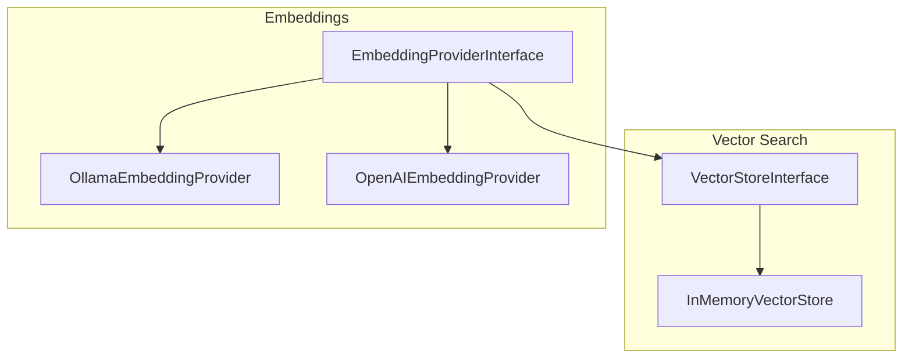

# Embeddings & Vector Stores

php-agents provides embedding providers and vector stores for semantic similarity search. These are framework primitives — your application decides how to integrate them with agent toolkits and storage.

## Architecture



## Vector Stores

For semantic similarity search (finding memories by meaning rather than exact text), use a vector store with an embedding provider.

### InMemoryVectorStore

A simple in-memory vector store for development and small datasets:

```php
use CarmeloSantana\PHPAgents\Memory\InMemoryVectorStore;
use CarmeloSantana\PHPAgents\Embedding\OllamaEmbeddingProvider;

$embedder = new OllamaEmbeddingProvider(model: 'nomic-embed-text');
$vectorStore = new InMemoryVectorStore();

// Store with embeddings
$embedding = $embedder->embed('PHP is a server-side scripting language');
$vectorStore->upsert('php-desc', $embedding, ['text' => 'PHP is a server-side scripting language']);

// Search by similarity
$queryEmbedding = $embedder->embed('What programming language runs on servers?');
$results = $vectorStore->search($queryEmbedding, limit: 3);
// Returns nearest neighbors by cosine similarity
```

### VectorStoreInterface

```php
interface VectorStoreInterface
{
    /** Insert or update a vector with metadata. */
    public function upsert(string $id, array $embedding, array $metadata = []): void;

    /** Search for nearest neighbors. */
    public function search(array $embedding, int $limit = 5): array;

    /** Delete a vector by ID. */
    public function delete(string $id): bool;
}
```

## Embedding Providers

### OllamaEmbeddingProvider

Uses Ollama's local embedding models:

```php
use CarmeloSantana\PHPAgents\Embedding\OllamaEmbeddingProvider;

$embedder = new OllamaEmbeddingProvider(
    model: 'nomic-embed-text',
    baseUrl: 'http://localhost:11434',
);

$vector = $embedder->embed('Hello, world!');
// float[] — the embedding vector
```

### OpenAIEmbeddingProvider

Uses OpenAI's embedding API:

```php
use CarmeloSantana\PHPAgents\Embedding\OpenAIEmbeddingProvider;

$embedder = new OpenAIEmbeddingProvider(
    model: 'text-embedding-3-small',
    apiKey: getenv('OPENAI_API_KEY'),
);

$vector = $embedder->embed('Hello, world!');
```

### EmbeddingProviderInterface

```php
interface EmbeddingProviderInterface
{
    /** Convert text to an embedding vector. */
    public function embed(string $text): array;
}
```

## Using with Agents

Vector stores and embedding providers are framework primitives. Your application decides how to expose them to agents — for example, by building a custom toolkit that wraps vector store operations as agent-facing tools.

For persistent vector storage at scale, consider the `hkulekci/qdrant` package which provides a Qdrant vector database client.
