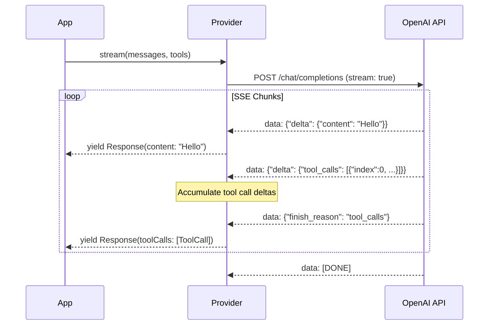
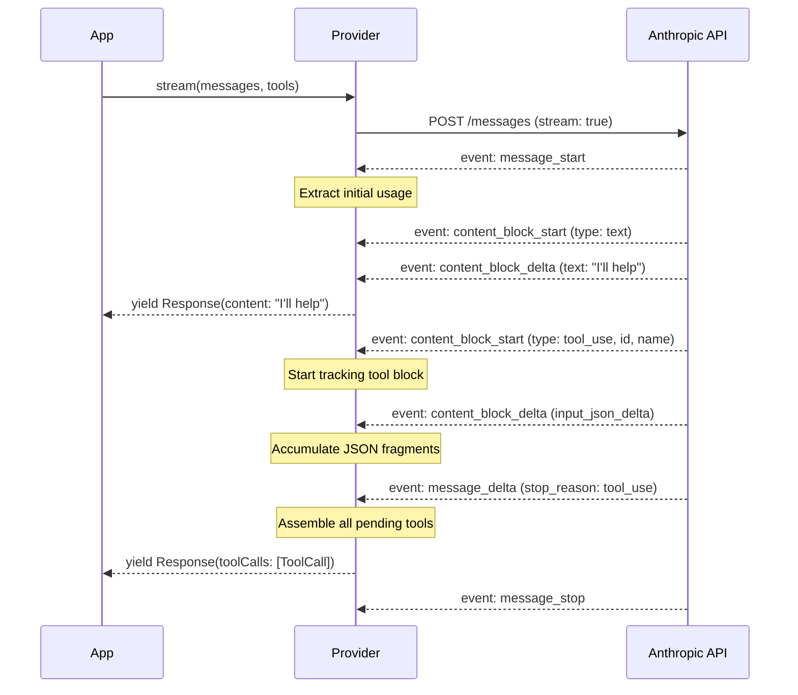

# Providers

Providers abstract the differences between LLM APIs. php-agents ships with providers covering the major ecosystems.

## Provider Feature Matrix

| Feature | OpenAI Compatible | OpenAI Responses | Ollama | Anthropic | Gemini | xAI | Mistral | LlamaCpp |
|---------|:-:|:-:|:-:|:-:|:-:|:-:|:-:|:-:|
| `chat()` | ✅ | ✅ | ✅ | ✅ | ✅ | ✅ | ✅ | ✅ |
| `stream()` | ✅ | ✅ | ✅ | ✅ | ✅ | ✅ | ✅ | ✅ |
| `structured()` | ✅ | ✅ | ✅ | ✅ | ✅ | ✅ | ✅ | ✅ |
| Tool calling | ✅ | ✅ | ✅ | ✅ | ✅ | ✅ | ✅ | ✅ |
| Streaming + tool calls | ✅ | ✅ | ✅ | ✅ | ✅ | ✅ | ✅ | ✅ |
| Image input (base64) | ✅ | ✅ | ✅ | ✅ | ✅ | ✅ | ✅ | ✅ |
| Image input (URL) | ✅ | ✅ | ✅ | ✅ | ✅* | ✅ | ✅ | ✅ |
| `models()` list | ✅ | ✅ | ✅ | ✅ | ✅ | ✅ | ✅ | ✅ |
| `isAvailable()` health check | ✅ | ✅ | ✅ | ✅ | ✅ | ✅ | ✅ | ✅ |
| `withModel()` immutable swap | ✅ | ✅ | ✅ | ✅ | ✅ | ✅ | ✅ | ✅ |

\* Gemini does not natively support URL image references. The provider auto-downloads URL images and converts them to base64 `inlineData` for seamless compatibility.

**CliProvider** (the `claude` CLI vendor) runs as a raw chat completion and has a narrower profile:
`chat()`, `stream()`, `structured()` (best-effort JSON), `models()`, `isAvailable()`, and
`withModel()` are supported. Native tool calling and image input are **not** in v1 — the host app's
own toolkits run the tools and prior tool history is folded into the prompt. See
[CliProvider (CLI Vendors)](#cliprovider-cli-vendors) below.

## LlamaCppProvider

`LlamaCppProvider` is the direct local provider for llama.cpp-backed runtimes. It keeps the same message, tool, streaming, multimodal, and structured-output surface as the rest of php-agents while dispatching through a local runtime instead of HTTP.

The provider is typically paired with `docs/LOCAL-RUNTIME.md`, which documents the native FFI runtime, setup steps, and the guarded integration matrix.

```php
use CarmeloSantana\PHPAgents\Provider\LlamaCppProvider;
use CarmeloSantana\PHPAgents\Runtime\LlamaCpp\FfiLlamaCppNativeApi;
use CarmeloSantana\PHPAgents\Runtime\LlamaCpp\LlamaCppNativeRuntime;

$runtime = new LlamaCppNativeRuntime(
    new FfiLlamaCppNativeApi(getenv('LLAMA_CPP_LIB_PATH')),
    [],
    ['threads' => 2, 'numCtx' => 4096],
);

$provider = new LlamaCppProvider(
    model: getenv('LLAMA_CPP_MODEL_PATH'),
    runtime: $runtime,
);
```

### Native Runtime Notes

- Direct text generation and streaming are handled inside the native llama.cpp runtime.
- Strict structured output uses a JSON grammar plus schema validation at the runtime layer.
- Image input is supported when the model has a matching projector GGUF and `libmtmd` is available.
- The provider still owns history formatting, tool prompt injection, and tool-call parsing so the high-level provider contract remains consistent with remote backends.

## OpenAICompatibleProvider

The base provider for any API that follows the OpenAI chat completions format. Works with OpenAI, OpenRouter, Together, Groq, vLLM, LM Studio, and many others.

```php
use CarmeloSantana\PHPAgents\Provider\OpenAICompatibleProvider;

$provider = new OpenAICompatibleProvider(
    model: 'gpt-4o',
    apiKey: getenv('OPENAI_API_KEY'),
    baseUrl: 'https://api.openai.com/v1',  // default
);
```

### Configuration

| Parameter | Type | Default | Description |
|-----------|------|---------|-------------|
| `model` | `string` | — | Model identifier (required) |
| `apiKey` | `string` | `''` | API key for authentication |
| `baseUrl` | `string` | `'https://api.openai.com/v1'` | API base URL |
| `httpClient` | `?HttpClientInterface` | `null` | Custom Symfony HTTP client |

### Environment Variables

The provider reads these if not passed directly:

| Variable | Used By |
|----------|---------|
| `OPENAI_API_KEY` | `OpenAICompatibleProvider` |

### Streaming with Tool Calls

The `stream()` method yields `Response` objects as SSE chunks arrive. Tool call deltas are accumulated across chunks and yielded as complete `ToolCall` objects when the model signals `finish_reason: tool_calls`:

```php
foreach ($provider->stream($messages, $tools) as $response) {
    // Text content arrives incrementally
    if ($response->content !== '') {
        echo $response->content;
    }

    // Tool calls arrive fully assembled when the model is done calling
    foreach ($response->toolCalls as $toolCall) {
        $result = $tool->execute($toolCall->arguments);
    }
}
```



### Structured Output

Uses OpenAI's JSON mode with response format:

```php
$result = $provider->structured(
    messages: [new UserMessage('Extract the name and age from: "John is 30 years old"')],
    schema: [
        'type' => 'object',
        'properties' => [
            'name' => ['type' => 'string'],
            'age' => ['type' => 'integer'],
        ],
        'required' => ['name', 'age'],
    ],
);
// ['name' => 'John', 'age' => 30]
```

### Using with Other Services

```php
// OpenRouter
$provider = new OpenAICompatibleProvider(
    model: 'anthropic/claude-sonnet-4-20250514',
    apiKey: getenv('OPENROUTER_API_KEY'),
    baseUrl: 'https://openrouter.ai/api/v1',
);

// Together AI
$provider = new OpenAICompatibleProvider(
    model: 'meta-llama/Llama-3.1-70B-Instruct-Turbo',
    apiKey: getenv('TOGETHER_API_KEY'),
    baseUrl: 'https://api.together.xyz/v1',
);

// Local vLLM / LM Studio
$provider = new OpenAICompatibleProvider(
    model: 'my-model',
    baseUrl: 'http://localhost:8000/v1',
);
```

## OllamaProvider

Extends `OpenAICompatibleProvider` with Ollama-specific model listing and health checks.

```php
use CarmeloSantana\PHPAgents\Provider\OllamaProvider;

$provider = new OllamaProvider(
    model: 'llama3.2',
    baseUrl: 'http://localhost:11434',  // default
);
```

### Configuration

| Parameter | Type | Default | Description |
|-----------|------|---------|-------------|
| `model` | `string` | — | Model name (as pulled with `ollama pull`) |
| `baseUrl` | `string` | `'http://localhost:11434'` | Ollama server URL |
| `httpClient` | `?HttpClientInterface` | `null` | Custom HTTP client |

### Model Discovery

```php
$models = $provider->models();
// Returns ModelDefinition[] with name, contextWindow, maxTokens
// Reads from Ollama's /api/tags endpoint
```

### Health Check

```php
if ($provider->isAvailable()) {
    // Ollama is running and responding
}
// Hits GET /api/tags — returns true if 2xx
```

### Environment Variables

| Variable | Used By |
|----------|---------|
| `OLLAMA_HOST` | `OllamaProvider` (falls back to `http://localhost:11434`) |

## AnthropicProvider

Purpose-built provider for Claude models. Handles Anthropic's unique message format (system as top-level parameter, not a message), content block types, and tool use protocol.

```php
use CarmeloSantana\PHPAgents\Provider\AnthropicProvider;

$provider = new AnthropicProvider(
    model: 'claude-sonnet-4-20250514',
    apiKey: getenv('ANTHROPIC_API_KEY'),
);
```

### Configuration

| Parameter | Type | Default | Description |
|-----------|------|---------|-------------|
| `model` | `string` | — | Model identifier (required) |
| `apiKey` | `string` | `''` | Anthropic API key |
| `baseUrl` | `string` | `'https://api.anthropic.com/v1'` | API base URL |
| `httpClient` | `?HttpClientInterface` | `null` | Custom HTTP client |

### Image Support

Anthropic uses a different image format than OpenAI. php-agents automatically converts between formats:

```php
// This works with both OpenAI and Anthropic providers:
$message = new UserMessage([
    ['type' => 'text', 'text' => 'What is in this image?'],
    [
        'type' => 'image_url',
        'image_url' => [
            'url' => 'data:image/png;base64,' . base64_encode(file_get_contents('photo.png')),
        ],
    ],
]);

// OpenAI sends it as-is
// Anthropic converts to: {type: "image", source: {type: "base64", media_type: "image/png", data: "..."}}
```

**Note:** Anthropic supports both base64-encoded data URIs and URL-based images. The provider automatically converts OpenAI-format `image_url` blocks to Anthropic's native `image` source format.

### Streaming with Tool Calls

Anthropic uses a different streaming protocol (content blocks + deltas) than OpenAI (token-level deltas). php-agents normalizes both to the same `Response` yield pattern:



### Structured Output

Uses Anthropic's tool-use trick: defines the schema as a tool, forces the model to use it, and extracts the structured result:

```php
$result = $provider->structured(
    messages: [new UserMessage('Extract: "Jane, age 25, from NYC"')],
    schema: [
        'type' => 'object',
        'properties' => [
            'name' => ['type' => 'string'],
            'age' => ['type' => 'integer'],
            'city' => ['type' => 'string'],
        ],
        'required' => ['name', 'age', 'city'],
    ],
);
// ['name' => 'Jane', 'age' => 25, 'city' => 'NYC']
```

### Model List

The provider tries Anthropic's models API first, then falls back to a static list:

```php
$models = $provider->models();
// ModelDefinition[] — includes context windows and max output tokens
```

Static fallback models:

| Model | Context Window | Max Output |
|-------|:-:|:-:|
| `claude-sonnet-4-20250514` | 200K | 8,192 |
| `claude-opus-4-20250514` | 200K | 32,000 |
| `claude-3-5-haiku-20241022` | 200K | 8,192 |
| `claude-3-5-sonnet-20241022` | 200K | 8,192 |
| `claude-3-opus-20240229` | 200K | 4,096 |
| `claude-3-haiku-20240307` | 200K | 4,096 |

### Health Check

```php
if ($provider->isAvailable()) {
    // API key is valid and Anthropic API is responding
}
// Makes actual HTTP request to /models endpoint
```

### Environment Variables

| Variable | Used By |
|----------|---------|
| `ANTHROPIC_API_KEY` | `AnthropicProvider` |

## GeminiProvider

Native provider for Google Gemini models. Uses Gemini's REST API directly (not the OpenAI-compatible endpoint) for full access to Gemini-specific features: `inlineData` images, `functionDeclarations` tool calling, and structured output via `response_mime_type`.

```php
use CarmeloSantana\PHPAgents\Provider\GeminiProvider;

$provider = new GeminiProvider(
    model: 'gemini-2.5-flash',
    apiKey: getenv('GEMINI_API_KEY'),
);
```

### Configuration

| Parameter | Type | Default | Description |
|-----------|------|---------|-------------|
| `model` | `string` | `'gemini-2.5-flash'` | Model identifier |
| `apiKey` | `string` | `''` | Google AI API key |
| `baseUrl` | `string` | `'https://generativelanguage.googleapis.com/v1beta'` | API base URL |
| `httpClient` | `?HttpClientInterface` | `null` | Custom HTTP client |

### Tool Calling

Gemini uses `functionCall`/`functionResponse` parts within the Content format. The provider generates compact 9-character alphanumeric synthetic IDs (e.g. `g00000000`) for tool calls since Gemini's API doesn't return call IDs natively. The `functionResponse` name field uses the actual function name resolved from the preceding assistant message's tool calls.

### Image Support

Gemini uses `inlineData` parts with base64-encoded image data. The provider automatically converts OpenAI-format `image_url` blocks:

- **Base64 data URIs** are extracted and sent as `inlineData` with the correct MIME type
- **URL images** are auto-downloaded and converted to base64 `inlineData` (Gemini doesn't support URL references natively)

```php
// Both formats work transparently:
$message = new UserMessage([
    ['type' => 'text', 'text' => 'What is in this image?'],
    [
        'type' => 'image_url',
        'image_url' => ['url' => 'https://example.com/photo.jpg'],  // auto-downloaded
    ],
]);
```

### Environment Variables

| Variable | Used By |
|----------|---------|
| `GEMINI_API_KEY` | `GeminiProvider` |

## OpenAIResponsesProvider

Provider for OpenAI's Responses API (`/v1/responses`). Required for Codex models (`gpt-5-codex`, etc.) that don't support the Chat Completions endpoint. Also works as a forward-compatible alternative for standard models like `gpt-4o` and `gpt-5`.

```php
use CarmeloSantana\PHPAgents\Provider\OpenAIResponsesProvider;

$provider = new OpenAIResponsesProvider(
    model: 'gpt-5-codex',
    apiKey: getenv('OPENAI_API_KEY'),
);
```

### Key Differences from Chat Completions

| Aspect | Chat Completions | Responses API |
|--------|-----------------|---------------|
| Endpoint | `POST /v1/chat/completions` | `POST /v1/responses` |
| Request field | `messages` | `input` |
| Tool results | `role: tool` messages | `function_call_output` items |
| Response field | `choices[0].message` | `output` array of items |

### Configuration

| Parameter | Type | Default | Description |
|-----------|------|---------|-------------|
| `model` | `string` | — | Model identifier (required) |
| `apiKey` | `string` | `''` | OpenAI API key |
| `baseUrl` | `string` | `'https://api.openai.com/v1'` | API base URL |
| `httpClient` | `?HttpClientInterface` | `null` | Custom HTTP client |

### Auto-Routing

`ProviderFactory` automatically routes Codex models to `OpenAIResponsesProvider`. You can also force it via the `api` field in provider config:

```json
{
    "models": {
        "providers": {
            "openai": {
                "api": "openai-responses"
            }
        }
    }
}
```

### Environment Variables

| Variable | Used By |
|----------|---------|
| `OPENAI_API_KEY` | `OpenAIResponsesProvider` |

## XAIProvider

Provider for xAI (Grok) models. Extends `OpenAICompatibleProvider` with xAI-specific vision content type conversion.

```php
use CarmeloSantana\PHPAgents\Provider\XAIProvider;

$provider = new XAIProvider(
    model: 'grok-3',
    apiKey: getenv('XAI_API_KEY'),
);
```

### Vision Content Types

xAI uses different content type names than OpenAI for vision messages. The provider automatically converts:

| OpenAI Format | xAI Format |
|--------------|------------|
| `{type: "text", ...}` | `{type: "input_text", ...}` |
| `{type: "image_url", ...}` | `{type: "input_image", image_url: "<url>", detail: "high"}` |

Both URL and base64 data URI images are supported.

### Environment Variables

| Variable | Used By |
|----------|---------|
| `XAI_API_KEY` | `XAIProvider` |

## MistralProvider

Provider for Mistral AI models. Extends `OpenAICompatibleProvider` with Mistral-specific normalizations for image format and tool call IDs.

```php
use CarmeloSantana\PHPAgents\Provider\MistralProvider;

$provider = new MistralProvider(
    model: 'mistral-large-latest',
    apiKey: getenv('MISTRAL_API_KEY'),
);
```

### Image Format

Mistral accepts `image_url` as a flat string instead of a nested object. The provider normalizes OpenAI-format nested `image_url` objects:

```
// OpenAI format (nested):   {image_url: {url: "..."}}
// Mistral format (flat):    {image_url: "..."}
```

Both URL and base64 data URI images are supported.

### Tool Call ID Normalization

Mistral requires `tool_call_id` to be exactly 9 alphanumeric characters (`[a-zA-Z0-9]{9}`). When conversation history contains tool call IDs from other providers (OpenAI's `call_*`, Anthropic's `toolu_*`, Gemini's synthetic IDs), the provider normalizes them to compliant 9-character alphanumeric IDs during `formatMessages()`.

The normalization is deterministic (SHA-256 hash-based), so the same conversation replayed produces identical IDs. IDs already in Mistral's format pass through unchanged. The mapping is applied consistently to both assistant message `tool_calls[].id` and tool result `tool_call_id` fields to maintain correct pairing.

### Environment Variables

| Variable | Used By |
|----------|---------|
| `MISTRAL_API_KEY` | `MistralProvider` |

## CliProvider (CLI Vendors)

`CliProvider` drives a local command-line binary as an LLM backend instead of an HTTP API. The first
supported vendor is the **Claude Code CLI** (`claude`), run headless as a raw chat completion. It is
the expandable path for adding other CLIs (codex, grok, deepseek, ...) later.

Two seams keep the design open and the library dependency-free:

- **`CliVendorAdapterInterface`** — vendor-specific knowledge: how to turn messages/tools/model into
  argv + stdin for a given binary, how to parse its stdout into a `Response`/`Usage`, and the model
  catalog. One adapter per binary; `ClaudeCliVendorAdapter` is the first.
- **`CliRuntimeInterface`** — host-supplied process executor. php-agents never calls `proc_open` (it
  depends only on `symfony/http-client` + `psr/log`); the host injects a runtime that spawns the
  binary. This mirrors how `LocalModelRuntimeInterface` is injected for `LlamaCppProvider`, and lets
  the host make execution event-loop/Fiber friendly (e.g. Coqui's ReactPHP runtime keeps the REPL
  spinner alive during a CLI call).

```php
use CarmeloSantana\PHPAgents\Provider\CliProvider;
use CarmeloSantana\PHPAgents\Provider\Cli\ClaudeCliVendorAdapter;

$provider = new CliProvider(
    model: 'sonnet',                       // or 'opus' / 'haiku' / a full id
    adapter: new ClaudeCliVendorAdapter(), // binary defaults to `claude`
    runtime: $cliRuntime,                  // host implementation of CliRuntimeInterface
);
```

### Raw-LLM invocation

`ClaudeCliVendorAdapter` invokes the binary in print mode with all built-in tooling disabled, so it
behaves like a plain chat completion and the host app's own toolkits/safety model stay in control:

```bash
claude -p --tools "" --strict-mcp-config --bare --no-session-persistence \
  --model <id> --system-prompt <system> --output-format json   # stdin = flattened transcript
```

For `stream()` it swaps to `--output-format stream-json --verbose --include-partial-messages` and
parses the NDJSON event stream. The CLI emits a `system`/init line, zero or more `stream_event`
envelopes (Anthropic SSE `text_delta`s, only when partial messages are enabled), a complete
`assistant` message that restates the text, then a terminal `result` line with the full text, usage,
and stop reason. The adapter prefers the incremental deltas and suppresses the duplicated text from
the `assistant`/`result` lines; if no deltas arrived it falls back to the `assistant` (then `result`)
full text so content is never dropped. A `result` with `is_error: true` (e.g. *"Not logged in"*) is
raised as an exception.

**Model discovery is curated, not live.** The `claude` CLI has no machine-readable model-list command
— it only accepts `--model <alias|id>`. `models()` therefore returns a fixed list of the stable
aliases (`fable`, `opus`, `sonnet`, `haiku`); any full id works via the model string.

### Authentication & terms

The provider delegates authentication entirely to the user's existing `claude` install (its API key
or a token from `claude setup-token` / `CLAUDE_CODE_OAUTH_TOKEN`). It does **not** drive a claude.ai
Pro/Max subscription login — Anthropic's terms reserve subscription auth for approved integrations and
direct third-party products to API-key auth. Use this provider only to invoke a CLI you have already
authenticated yourself.

### Token budgeting

The Claude SDK JSON output reports `usage.input_tokens`, `output_tokens`,
`cache_read_input_tokens`, `cache_creation_input_tokens`, and `total_cost_usd`. The adapter folds the
input + cache tokens into `Usage.promptTokens` so host-side budget tracking works the same as for
HTTP providers.

## Shared Provider Utilities

### PSR-3 Logging

All providers accept an optional `Psr\Log\LoggerInterface` via their constructor. When provided, errors in non-critical paths (model listing, health checks, image downloads) are logged instead of silently swallowed:

```php
use Monolog\Logger;
use Monolog\Handler\StreamHandler;

$logger = new Logger('providers');
$logger->pushHandler(new StreamHandler('php://stderr'));

$provider = new OllamaProvider(
    model: 'llama3.2',
    logger: $logger,
);
```

### SseStreamParser

Shared SSE line-buffering parser used by all streaming providers. Handles chunk boundary splits, `[DONE]` sentinels, and malformed JSON gracefully:

```php
use CarmeloSantana\PHPAgents\Provider\SseStreamParser;

$parser = new SseStreamParser($httpClient, $response);

foreach ($parser->events() as $payload) {
    // $payload is a decoded associative array from each `data: {...}` line
}
```

Custom providers can use `SseStreamParser` directly instead of implementing their own SSE buffering logic.

### SchemaUtils

Static helpers for JSON Schema normalization. Each method operates on a single schema node — providers handle their own recursion:

| Method | Purpose |
|--------|---------|
| `stripKeywords(array $schema, array $keywords)` | Remove unsupported keywords from a schema node |
| `flattenCombinator(array $schema, string $combinator)` | Replace `anyOf`/`oneOf`/`allOf` with the first non-null variant |
| `demoteConstraints(array $schema, array $templates)` | Move constraint metadata (minLength, enum, etc.) into the description field |

```php
use CarmeloSantana\PHPAgents\Provider\SchemaUtils;

// Strip keywords a provider doesn't support
$schema = SchemaUtils::stripKeywords($schema, ['additionalProperties', '$schema', 'default']);

// Flatten anyOf to a single type (for providers that don't support union types)
$schema = SchemaUtils::flattenCombinator($schema, 'anyOf');
```

## Creating a Custom Provider

Implement `ProviderInterface` or extend `AbstractProvider`:

```php
<?php

declare(strict_types=1);

namespace Acme\MyProvider;

use CarmeloSantana\PHPAgents\Contract\ProviderInterface;
use CarmeloSantana\PHPAgents\Message\Response;
use CarmeloSantana\PHPAgents\Provider\ModelDefinition;
use CarmeloSantana\PHPAgents\Tool\ToolCall;
use CarmeloSantana\PHPAgents\Tool\Usage;

final class MyProvider implements ProviderInterface
{
    public function chat(array $messages, array $tools = [], array $options = []): Response
    {
        // Send messages to your LLM, return a Response
        return new Response(
            content: 'Hello from my provider',
            toolCalls: [],
            usage: new Usage(inputTokens: 10, outputTokens: 5),
        );
    }

    public function stream(array $messages, array $tools = [], array $options = []): iterable
    {
        // Yield Response objects as they arrive
        yield new Response(content: 'Hello');
        yield new Response(content: ' world');
    }

    public function structured(array $messages, array $schema, array $options = []): mixed
    {
        // Return structured data matching the schema
        return ['result' => 'value'];
    }

    public function models(): array
    {
        return [
            new ModelDefinition(
                id: 'my-model',
                contextWindow: 128_000,
                maxTokens: 4096,
            ),
        ];
    }

    public function isAvailable(): bool
    {
        // Check if the provider is reachable
        return true;
    }

    public function getModel(): string
    {
        return 'my-model';
    }

    public function withModel(string $model): static
    {
        $clone = clone $this;
        // set model on clone
        return $clone;
    }
}
```
