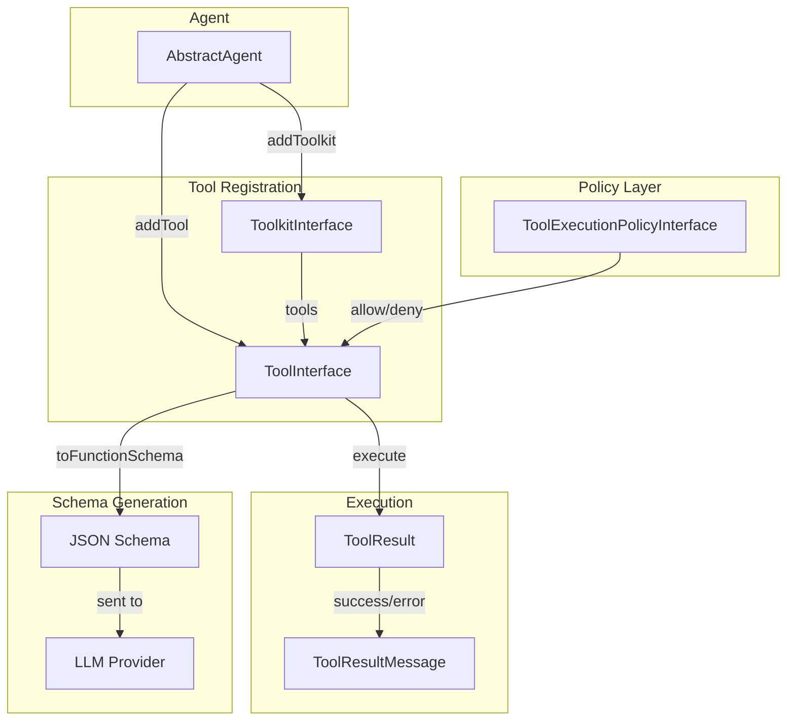
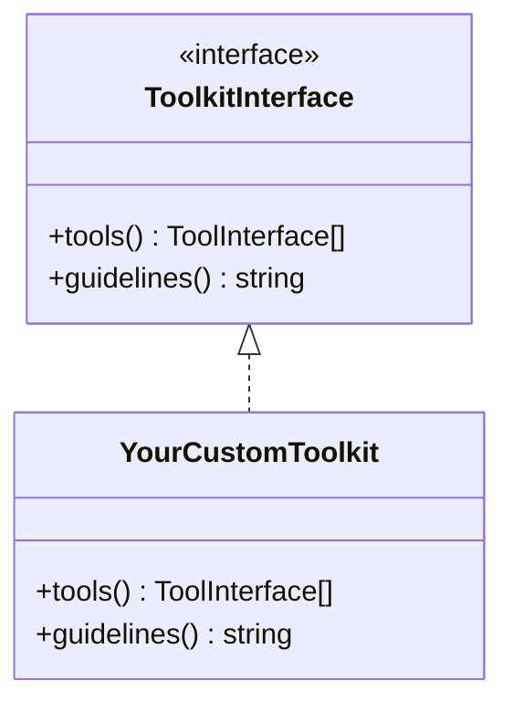

# Tools & Toolkits

Tools are the actions an agent can take. Toolkits group related tools with shared context and guidelines.

## Tool System Overview



## Creating Tools

### Basic Tool

```php
use CarmeloSantana\PHPAgents\Tool\Tool;
use CarmeloSantana\PHPAgents\Tool\ToolResult;
use CarmeloSantana\PHPAgents\Tool\Parameter\StringParameter;

$greet = new Tool(
    name: 'greet',
    description: 'Greet someone by name',
    parameters: [
        new StringParameter('name', 'The person to greet', required: true),
    ],
    callback: fn(array $args): ToolResult => ToolResult::success(
        "Hello, {$args['name']}!",
    ),
);
```

### Parameter Types

| Class | JSON Schema Type | Extra Options |
|-------|-----------------|---------------|
| `StringParameter` | `string` | — |
| `NumberParameter` | `number` | — |
| `BoolParameter` | `boolean` | — |
| `EnumParameter` | `string` (enum) | `values: string[]` |
| `ArrayParameter` | `array` | `items: Parameter` |
| `ObjectParameter` | `object` | `properties: Parameter[]` |

```php
use CarmeloSantana\PHPAgents\Tool\Parameter\{
    StringParameter,
    NumberParameter,
    BoolParameter,
    EnumParameter,
    ArrayParameter,
    ObjectParameter,
};

$tool = new Tool(
    name: 'create_event',
    description: 'Create a calendar event',
    parameters: [
        new StringParameter('title', 'Event title', required: true),
        new StringParameter('date', 'ISO 8601 date', required: true),
        new NumberParameter('duration', 'Duration in minutes'),
        new BoolParameter('recurring', 'Whether the event repeats'),
        new EnumParameter(
            name: 'priority',
            description: 'Event priority level',
            values: ['low', 'medium', 'high'],
        ),
        new ArrayParameter(
            name: 'attendees',
            description: 'List of attendee emails',
            items: new StringParameter('email', 'Attendee email'),
        ),
    ],
    callback: fn(array $args): ToolResult => ToolResult::success(
        json_encode($args),
    ),
);
```

### Parameter Validation

Required parameters are validated before the callback is invoked. If any required parameter is missing from the LLM's arguments, the tool returns an error without executing:

```php
// If the LLM calls greet({}) without 'name', it gets:
// ToolResult::error("Missing required parameters: name")
```

Declared parameter constraints are also enforced at runtime before the callback runs.
This means schema hints like string patterns, max length, enum values, numeric min/max,
and nested array/object parameter rules now protect the callback from invalid input.

```php
$tool = new Tool(
    name: 'create_project',
    description: 'Create a project',
    parameters: [
        new StringParameter('slug', 'Lowercase slug', pattern: '/^[a-z-]+$/'),
        new NumberParameter('count', 'Project count', required: false, integer: true, minimum: 1),
    ],
    callback: fn(array $args): ToolResult => ToolResult::success(
        sprintf('Creating %s x%d', $args['slug'], $args['count'] ?? 1),
    ),
);

// Invalid values fail before the callback executes:
// ToolResult::error('Parameter validation failed: Parameter "slug" does not match the required pattern. ...')
```

Validation remains additive and backward-compatible:
- Tools without extra constraints keep their current behavior
- Valid inputs continue to reach the callback unchanged
- Numeric parameters may be normalized before execution when the declared type allows it

### Tool Results

Tools return `ToolResult` with a status and content:

```php
use CarmeloSantana\PHPAgents\Tool\ToolResult;
use CarmeloSantana\PHPAgents\Tool\ToolResultStatus;

// Success
ToolResult::success('File created at /path/to/file.txt');

// Error
ToolResult::error('Permission denied: /etc/passwd');

// Structured JSON helper — still stored as string content for provider compatibility
ToolResult::json([
    'id' => 'artifact_123',
    'status' => 'created',
]);

// With call ID (set automatically by the agent loop)
new ToolResult(
    status: ToolResultStatus::Success,
    content: 'Done',
    callId: 'call_abc123',
);
```

`ToolResult` now also supports additive metadata and display hints without changing the
provider wire format. This is useful for internal inspection, UI hints, or future routing
logic while keeping `content` as a plain string.

```php
$result = ToolResult::success('Finished')
    ->withMetadata(['phase' => 'apply'])
    ->withMimeType('text/plain')
    ->withDisplayHint('plain-text');
```

### Custom Tool Classes

For complex tools, implement `ToolInterface` directly:

```php
<?php

declare(strict_types=1);

namespace Acme\Tools;

use CarmeloSantana\PHPAgents\Contract\ToolInterface;
use CarmeloSantana\PHPAgents\Tool\Parameter\StringParameter;
use CarmeloSantana\PHPAgents\Tool\ToolResult;

final class DatabaseQueryTool implements ToolInterface
{
    public function __construct(
        private readonly \PDO $db,
    ) {}

    public function name(): string
    {
        return 'query_database';
    }

    public function description(): string
    {
        return 'Execute a read-only SQL query against the database';
    }

    public function parameters(): array
    {
        return [
            new StringParameter('sql', 'The SQL SELECT query to execute', required: true),
        ];
    }

    public function execute(array $input): ToolResult
    {
        $sql = $input['sql'] ?? '';

        if (!str_starts_with(strtoupper(trim($sql)), 'SELECT')) {
            return ToolResult::error('Only SELECT queries are allowed');
        }

        try {
            $stmt = $this->db->query($sql);
            $rows = $stmt->fetchAll(\PDO::FETCH_ASSOC);
            return ToolResult::success(json_encode($rows, JSON_PRETTY_PRINT));
        } catch (\PDOException $e) {
            return ToolResult::error('Query failed: ' . $e->getMessage());
        }
    }

    public function toFunctionSchema(): array
    {
        return [
            'type' => 'function',
            'function' => [
                'name' => $this->name(),
                'description' => $this->description(),
                'parameters' => [
                    'type' => 'object',
                    'properties' => [
                        'sql' => [
                            'type' => 'string',
                            'description' => 'The SQL SELECT query to execute',
                        ],
                    ],
                    'required' => ['sql'],
                ],
            ],
        ];
    }
}
```

## Toolkits

Toolkits group related tools and provide guidelines that are injected into the system prompt.

php-agents does not ship built-in toolkit implementations. It provides `ToolkitInterface` as the contract — your application supplies the implementations. Downstream products like [Coqui](https://github.com/AgentCoqui/coqui) provide filesystem, shell, memory, and other toolkits as separate packages.



### Creating a Toolkit

```php
<?php

declare(strict_types=1);

namespace Acme\Toolkit;

use CarmeloSantana\PHPAgents\Contract\ToolkitInterface;
use CarmeloSantana\PHPAgents\Tool\Tool;
use CarmeloSantana\PHPAgents\Tool\ToolResult;
use CarmeloSantana\PHPAgents\Tool\Parameter\StringParameter;
use CarmeloSantana\PHPAgents\Tool\Parameter\EnumParameter;

final class GitToolkit implements ToolkitInterface
{
    public function __construct(
        private readonly string $repoPath,
    ) {}

    public function tools(): array
    {
        return [
            new Tool(
                name: 'git_status',
                description: 'Show the working tree status',
                parameters: [],
                callback: fn(array $args): ToolResult => $this->execGit('status --porcelain'),
            ),
            new Tool(
                name: 'git_log',
                description: 'Show recent commit history',
                parameters: [
                    new StringParameter('count', 'Number of commits to show'),
                ],
                callback: fn(array $args): ToolResult => $this->execGit(
                    sprintf('log --oneline -n %d', (int) ($args['count'] ?? 10)),
                ),
            ),
            new Tool(
                name: 'git_diff',
                description: 'Show changes in the working tree',
                parameters: [
                    new StringParameter('path', 'File path to diff'),
                    new EnumParameter('type', 'Diff type', values: ['staged', 'unstaged']),
                ],
                callback: fn(array $args): ToolResult => $this->execGit(
                    sprintf(
                        'diff %s -- %s',
                        ($args['type'] ?? 'unstaged') === 'staged' ? '--cached' : '',
                        escapeshellarg($args['path'] ?? '.'),
                    ),
                ),
            ),
        ];
    }

    public function guidelines(): string
    {
        return <<<GUIDELINES
        Use git tools to inspect repository state:
        - Use git_status before making changes to understand the current state
        - Use git_log to understand recent history
        - Use git_diff to review specific changes before committing
        GUIDELINES;
    }

    private function execGit(string $subcommand): ToolResult
    {
        $cmd = sprintf('cd %s && git %s', escapeshellarg($this->repoPath), $subcommand);
        $output = shell_exec($cmd);

        return $output !== null
            ? ToolResult::success($output)
            : ToolResult::error('Git command failed');
    }
}
```

### Optional Rich Tool Documentation

If a tool needs richer generic prompt documentation than its name, description, and
parameter list, it can optionally implement `ToolDocumentationInterface`.

```php
use CarmeloSantana\PHPAgents\Contract\ToolDocumentationInterface;

final class SearchTool implements ToolInterface, ToolDocumentationInterface
{
    public function useWhen(): ?string
    {
        return 'Use this when you know the capability you need but not the exact record ID.';
    }

    public function examples(): array
    {
        return [
            'query: "recent invoices"',
            'query: "customer by email"',
        ];
    }

    // ... remaining ToolInterface methods ...
}
```

`SystemPrompt::withTools()` uses this interface to render optional “Use when” guidance and
examples in the generic tool docs. Provider tool schemas are unchanged.

## Tool Execution Policies

Control which tools can execute via `ToolExecutionPolicyInterface`:

```php
<?php

declare(strict_types=1);

namespace Acme\Policy;

use CarmeloSantana\PHPAgents\Contract\ToolExecutionPolicyInterface;
use CarmeloSantana\PHPAgents\Contract\ToolInterface;
use CarmeloSantana\PHPAgents\Tool\ToolCall;

final class ReadOnlyPolicy implements ToolExecutionPolicyInterface
{
    private const WRITE_TOOLS = [
        'write_file', 'delete_file', 'create_directory',
    ];

    public function shouldExecute(ToolInterface $tool, ToolCall $toolCall): bool
    {
        return !in_array($tool->name(), self::WRITE_TOOLS, true);
    }
}
```

Register on the agent:

```php
$agent = new MyAgent(
    provider: $provider,
    executionPolicy: new ReadOnlyPolicy(),
);
```

When a tool is denied by policy, the agent receives a denial message and can adjust its approach.

## Publishing Toolkit Packages

Distribute your toolkit as a Composer package with auto-discovery:

### Package Structure

```
my-toolkit/
├── composer.json
├── src/
│   └── MyToolkit.php
└── tests/
    └── MyToolkitTest.php
```

### composer.json

```json
{
    "name": "acme/my-toolkit",
    "description": "My awesome toolkit for php-agents",
    "type": "library",
    "require": {
        "php": "^8.4",
        "carmelosantana/php-agents": "^1.0"
    },
    "autoload": {
        "psr-4": {
            "Acme\\MyToolkit\\": "src/"
        }
    },
    "extra": {
        "php-agents": {
            "toolkits": ["Acme\\MyToolkit\\MyToolkit"],
            "credentials": {
                "MY_SERVICE_API_KEY": "API key for MyService — get one at https://myservice.com/keys"
            }
        }
    }
}
```

The `extra.php-agents` section enables:
- **`toolkits`**: Auto-discovery by host applications (like Coqui). The toolkit is instantiated and registered automatically when the package is installed.
- **`credentials`**: Declared credential requirements. Host applications wrap the toolkit with a credential guard that prompts for missing keys before any tool executes.

### Credential Resolution

Declare credentials in `composer.json` and resolve lazily at runtime:

```php
final class MyToolkit implements ToolkitInterface
{
    private string $apiKey = '';

    public function tools(): array
    {
        return [
            new Tool(
                name: 'my_api_call',
                description: 'Call MyService API',
                parameters: [...],
                callback: fn(array $args): ToolResult => $this->callApi($args),
            ),
        ];
    }

    private function callApi(array $args): ToolResult
    {
        $key = $this->resolveApiKey();
        // ... use $key
    }

    private function resolveApiKey(): string
    {
        if ($this->apiKey !== '') {
            return $this->apiKey;
        }

        $env = getenv('MY_SERVICE_API_KEY');
        return $env !== false ? $env : '';
    }
}
```

The lazy resolution pattern enables hot-reload: when a user provides a credential at runtime, `putenv()` makes it immediately available without restarting.

## The DoneTool

`DoneTool` is a special built-in tool that signals the agent loop to stop. When the LLM calls it, the agent returns the final response:

```php
use CarmeloSantana\PHPAgents\Tool\DoneTool;

// The DoneTool is automatically registered by AbstractAgent
// The LLM calls it when it wants to deliver a final answer:
// tool_call: done(response: "Here is my answer...")
```

The agent's system prompt instructs the LLM to call `done` when it has completed the task.
